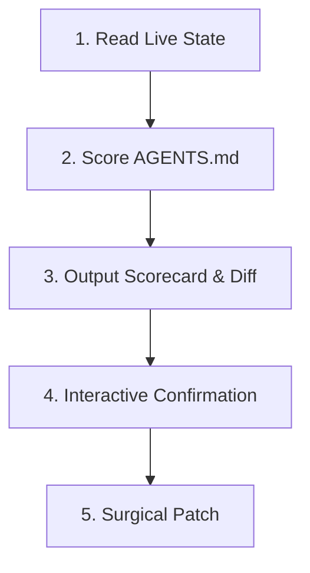

# `audit`

Audits the workspace's `AGENTS.md` file against the live state of the codebase, identifies architectural drift or stale instructions, evaluates file quality using a standardized 100-point rubric, and proposes surgical improvements.

---

## When to Use

Activate this skill when:
- The user asks: *"Audit my agents.md file"*, *"Check if my agents.md is up to date"*, or *"Align agents.md with codebase"*.
- Major refactoring, directory moves, or dependency shifts have occurred.
- Performing periodic repository maintenance.
- Setting up a new or refreshed `AGENTS.md` for an existing project.

---

## Reference Guides

Detailed standards and specifications are disclosed behind pointers:
- **Evaluation Rubric & Checklist**: [quality-criteria.md](reference/quality-criteria.md) — 6-criterion Quick Assessment Checklist, 100-point formula, and Quality Scores (A–F).
- **Canonical Templates**: [templates.md](reference/templates.md) — Structural templates for single packages, monorepos, and modular rules.
- **Modification Protocol**: [update-guidelines.md](reference/update-guidelines.md) — Surgical editing, path verification, and user confirmation rules.

---

## Operational Workflow



### Phase 1: Inspect Live Codebase State
1. **Locate Target & Existing Rules**: Check for `AGENTS.md` (or `.agents/AGENTS.md`). Also scan `.agents/rules/*.md` to map existing ambient rules and avoid proposing duplicate instructions.
2. **Inspect Manifests**: Read `package.json`, `Cargo.toml`, `go.mod`, `pyproject.toml`, or `Makefile` to discover valid commands and dependencies.
3. **Map Directory Tree**: Check primary source folders, test directories, and configuration files.

### Phase 2: Audit with Quick Assessment Checklist
Evaluate `AGENTS.md` against [quality-criteria.md](reference/quality-criteria.md) across all 6 criteria:
- **Commands/workflows documented** (High, 20 pts)
- **Architecture clarity** (High, 20 pts)
- **Non-obvious patterns** (Medium, 10 pts)
- **Conciseness** (Medium, 10 pts) — Check for 24 KB limit, duplicate rules already covered in `.agents/rules/`, or oversized domain walkthroughs.
- **Currency** (High, 20 pts)
- **Actionability** (High, 20 pts)

Compute the total score (0–100) and assign the letter grade:
- **A (90–100)**: Comprehensive, current, actionable
- **B (70–89)**: Good coverage, minor gaps
- **C (50–69)**: Basic info, missing key sections
- **D (30–49)**: Sparse or outdated
- **F (0–29)**: Missing or severely outdated

### Phase 3: Formulate Audit Report & Scorecard
Generate a structured report containing:

1. **Quick Assessment Scorecard**:
   ```markdown
   ### AGENTS.md Audit Scorecard
   | Criterion | Weight | Score | Status / Findings |
   | :--- | :--- | :--- | :--- |
   | Commands/workflows documented | High (20) | [X]/20 | [Brief finding] |
   | Architecture clarity | High (20) | [X]/20 | [Brief finding] |
   | Non-obvious patterns | Medium (10) | [X]/10 | [Brief finding] |
   | Conciseness | Medium (10) | [X]/10 | [Brief finding] |
   | Currency | High (20) | [X]/20 | [Brief finding] |
   | Actionability | High (20) | [X]/20 | [Brief finding] |

   **Total Score: [X]/100 — Grade [A-F] ([Grade Label])**
   ```

2. **Identified Discrepancies & Offloading Recommendations**:
   - Bulleted breakdown of stale facts or missing commands.
   - **Modular Offloading Suggestions**: If `AGENTS.md` contains oversized, domain-specific sections (e.g., deep database schemas or multi-step release checklists), explicitly suggest moving them to the `.agents/rules/` directory to keep `AGENTS.md` lean. (Note: rule authoring is handled separately; this skill only identifies and recommends what to extract).

3. **Proposed Unified Diff**: Surgical edits adhering to [update-guidelines.md](reference/update-guidelines.md).

### Phase 4: User Confirmation & Update
Present the scorecard and proposed diff to the user. Wait for explicit confirmation before updating `AGENTS.md`.
