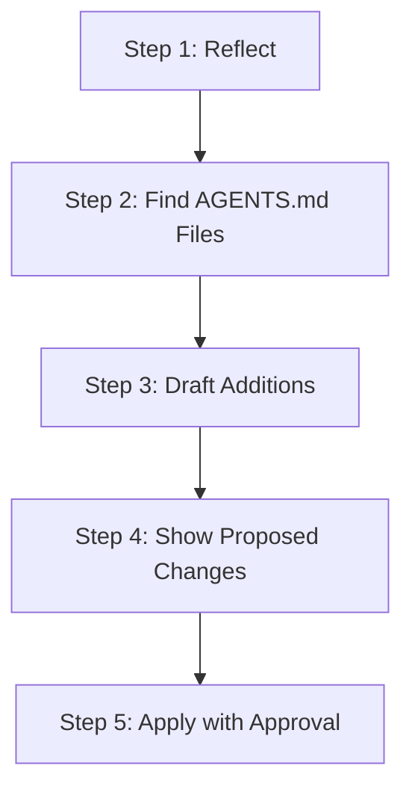

# `revise`

Review this session for learnings about working with Antigravity in this codebase. Update `AGENTS.md` with context that will help future Antigravity sessions be more effective.

---

## Invocation Modes

- **Active In-Session Mode (Default)**: Triggered via `/agents-md-improver:revise` or *"revise agents.md"*. Evaluates current working session memory and live execution logs.
- **Offline / Historical Mode**: Triggered with an explicit transcript path:
  ```bash
  /agents-md-improver:revise --transcript /path/to/transcript.jsonl
  ```

---

## Relationship to the Built-in `/learn`

Antigravity ships a built-in `/learn` command that distills session corrections into persistent **rules** or a new **skill**. The two are complementary, not alternatives:

| | `/learn` (built-in) | `revise` (this skill) |
| :--- | :--- | :--- |
| **Output target** | `.antigravity/rules.md`, or a new `SKILL.md` | `AGENTS.md` — project context |
| **Best for** | Constraints, invariants, reusable procedures | Commands, architecture, gotchas, environment quirks |
| **Input** | Instruction-driven: you name what to capture | Full session sweep across all signals |
| **Routing** | Single target | Hierarchical — nearest `AGENTS.md` in a monorepo |
| **Approval** | — | Itemised candidates, individually cherry-pickable |

Choose `revise` when the learning is **project context** that every future session needs. Choose `/learn` when it is a **constraint or a procedure** better expressed as a rule or a skill.

> **Upstream path conflict:** the `/learn` documentation states rules are written to `.antigravity/rules.md`, while the Rules documentation specifies `.agents/rules/*.md`. These disagree. Confirm the real location locally before relying on either.

---

## Reference Guides

- **Extraction Taxonomy & Rules**: [session-extraction.md](reference/session-extraction.md) — Heuristics for filtering signal from noise, parsing transcripts, and deduplicating instructions.

---

## 5-Step Operational Workflow



### Step 1: Reflect

Identify missing context that would have helped Antigravity work more effectively:
- **Bash commands** used, discovered, or corrected.
- **Code style & architectural patterns** enforced.
- **Testing approaches** and flags that worked.
- **Environment & configuration quirks** (ports, daemon dependencies, env vars).
- **Warnings & gotchas** encountered (sandbox blocks, permission issues, failure modes).

#### Signal Sources
1. **Execution Trajectory**: Scan tool execution logs for failures (`status == "ERROR"`), command retries, or sandbox fallbacks.
2. **User Corrections**: Identify prompts containing guidance or pivots (*"actually"*, *"instead"*, *"don't use"*, *"always"*).
3. **Workspace Changes**:
   - If in a Git repo: Inspect `git status` and `git diff` for changed files and patterns.
   - If not in a Git repo: Inspect `write_file` and `replace_file_content` events recorded in the session.

---

### Step 2: Find `AGENTS.md` Files & Existing Rules

Locate the appropriate target file using hierarchical discovery, and scan `.agents/rules/*.md` to ensure learned context isn't already covered by an existing rule:

1. **Root `AGENTS.md`**: Default target for repository-wide context (`AGENTS.md` or `.agents/AGENTS.md`).
2. **Monorepo / Multi-Package Routing**: In multi-package repositories, route package-specific learnings to the closest child file (e.g., `packages/api/AGENTS.md`, `apps/web/AGENTS.md`).
3. **Scan Existing Rules**: Check `.agents/rules/` to ensure the new learning doesn't duplicate a rule already defined elsewhere.
4. **Fallback Creation**: If no `AGENTS.md` exists in the workspace, offer to scaffold a minimal root `AGENTS.md` using standard templates.

---

### Step 3: Draft Additions

**Keep it concise** — one line per concept. `AGENTS.md` is loaded into every agent turn, so brevity matters.

- **Format**: `<command or pattern>` - `<brief description>`
- **Placement**:
  - Commands & test patterns → `## Key Commands`
  - Traps, failures, and environment quirks → `## Known Gotchas & Constraints`
  - Architectural standards & style rules → `## Conventions & Style`
- **Deduplication**: If an existing instruction covers the topic, sharpen the existing line rather than appending a duplicate.
- **Avoid**:
  - Verbose explanations or narratives.
  - Obvious general programming knowledge models already possess.
  - One-off bug fixes unlikely to recur.
  - Sensitive credentials or tokens.

---

### Step 4: Show Proposed Changes

Present proposed changes itemized for clear review:

For each candidate addition:

```markdown
### Candidate 1: [Target File Path]

**Target Section:** `## Key Commands` (or `## Known Gotchas`)
**Why:** [one-line reason citing session evidence]

\`\`\`diff
+ [the addition - keep it brief]
\`\`\`
```

---

### Step 5: Apply with Approval

Ask the user to review the itemized candidates:
- Support **All** approval or **Cherry-picking** specific numbered items (e.g., *"Apply #1 and #3, drop #2"*).
- Only modify files and lines explicitly approved by the user.
